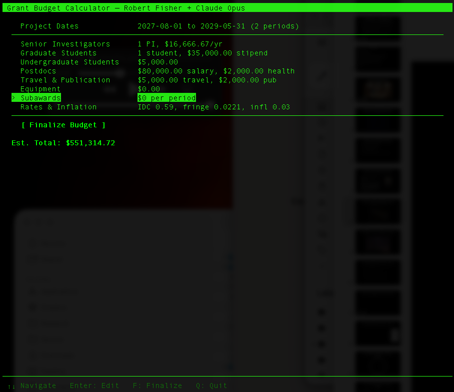

[](https://github.com/rtfisher/grant-budget-calculator/actions/workflows/tests.yml)

# Grant Budget Calculator

A Python tool for calculating research grant budgets with year-by-year inflation, fringe benefits, indirect costs, and subaward handling. Features a curses-based TUI with partial budget period support.

## Files

| File | Purpose |
|------|---------|
| `budget_tui.py` | Curses-based TUI -- menu-driven interface with live totals |
| `budget_partial_years.py` | Calculation engine and CLI alternative |
| `budget.par` | Editable parameter file with institutional rates and default values |
| `*.log` | Budget log files, named by agency/program/date (auto-generated) |

## Quick Start

```bash
python budget_tui.py               # TUI (primary interface)
python budget_partial_years.py     # CLI alternative
```

The TUI reads default rates from `budget.par` and presents a menu where you navigate budget categories with arrow keys, edit values, and finalize the budget. The CLI prompts interactively; press Enter to accept the default shown in brackets.

## TUI Interface



`budget_tui.py` provides a Pine/Alpine-style menu interface:

- **Arrow keys** navigate budget categories (Agency & Program, Project Dates, Senior Investigators, Graduate Students, Postdocs, etc.)
- **Enter** opens a sub-screen to edit values for that category
- **V** opens a read-only budget summary viewer (Tab toggles between NSF and Federal R&R formats)
- **F** finalizes the budget and displays results in a scrollable view
- **S** saves results to a log file (on the results screen)
- **L** loads a previously saved budget from a log file
- **Q** quits (with confirmation if unsaved)

The TUI supports partial budget periods via the Project Dates menu item (Tab toggles between date mode and year mode).

### Agency & Program

The first menu item lets you set the funding agency (e.g., "nasa", "nsf") and program call (e.g., "atp", "aag"). These are combined with today's date to generate unique log filenames like `nasa_atp_040826.log`. Duplicate filenames auto-increment: `nasa_atp_040826_v2.log`, etc.

### Loading a Previous Budget

Press **L** from the main menu to see a list of `.log` files in the current directory sorted by modification time. Selecting one parses the log and restores all budget fields, including agency, dates, PI details, salaries, rates, and subaward values.

## Parameter File (`budget.par`)

Institutional rates live in `budget.par`, a plain text file with `key = value` format. Lines starting with `#` are comments. Edit this file to update rates for a new fiscal year without modifying the script.

Key parameters:

| Parameter | Description | Example |
|-----------|-------------|---------|
| `indirect_rate` | F&A (indirect) cost rate | `0.59` |
| `fringe_rate` | Payroll tax rate (FICA) for part-time/summer wages | `0.0221` |
| `fulltime_fringe` | Full-time employee fringe benefit rate | `0.3781` |
| `inflation` | Annual salary/fee inflation rate | `0.03` |

Consult with your institutional office of research administration for current rates.

## Budget Calculation Details

- **Faculty salary**: Computed from 9-month base salary and number of summer months requested. Supports multiple PIs.
- **Fringe**: Payroll tax (`fringe_rate`) applies to faculty summer salary, graduate student summer stipend (25% of annual), and undergraduate salary. Postdocs use the full-time fringe rate.
- **Graduate students**: Annual stipend + tuition/fees + health insurance. Tuition/fees are excluded from MTDC; health insurance is part of fringe and remains in the MTDC base.
- **Equipment**: Fixed yearly cost, excluded from MTDC (no inflation).
- **Subawards**: Per-year amounts, excluded from MTDC. Indirect is charged on the first $25,000 of each year's subaward per NSF policy.
- **Inflation**: Applied at the end of each year to salaries, stipends, and fees for the following year.
- **Indirect (F&A)**: Applied to MTDC plus the capped subaward amount.

## Partial Budget Periods

`budget_partial_years.py` and `budget_tui.py` support fractional budget periods for grants whose duration is not a whole number of years (e.g., a 33-month award).

- Specify a **project start date** and **end date** (any dates -- no restriction to 1st of month).
- Budget periods are split at anniversary boundaries of the start date. The last period may be shorter.
- Grad/postdoc/undergrad salaries, stipends, fees, and health insurance are prorated by `days / 365.25` for each period. Faculty salary is not prorated (it is already scoped to the requested number of summer months). Equipment, travel, publication costs, and subaward values are fixed per-period and not scaled.
- **Summer months** (June, July, August) for graduate FICA are computed from the actual calendar overlap of each period, rather than using a hardcoded 3/12 fraction.
- Inflation compounds as `(1 + r) ^ frac` for fractional periods.
- The subaward indirect cap ($25k) is prorated for fractional periods.
- Skipping the date prompt (or using year mode in the TUI) gives full calendar years.

## Output Formats

The calculator produces two budget tables:

1. **NSF-style detailed table** -- Line-by-line breakdown of all salary, fringe, and cost components.
2. **Federal Research & Related (R&R) budget format** -- Standard federal R&R categories (A-K) used by NASA, DOE, NIH, and other Grants.gov agencies: Senior/Key Person, Other Personnel, Equipment, Travel, Participant/Trainee Support, Other Direct Costs, Direct/Indirect totals, Fee, and Budget Total.

## Logging

Each save creates a uniquely named log file (e.g., `nsf_aag_040826.log`) containing:
- Agency and program call
- All input parameters as entered (including per-student grad values)
- Per-PI base salary and summer months (for full reproducibility)
- Year-by-year budget breakdown (NSF and NASA formats)
- Final summary totals

Log files contain sufficient detail to fully restore budget state via the **L: Load** feature.

## Requirements

- Python 3.6+
- No third-party dependencies (`curses` is in the Python standard library)
- Windows users need `pip install windows-curses` for the TUI

## Running Tests

```bash
pip install pytest
pytest                                    # run all tests (203 total)
pytest tests/test_budget_partial_years.py  # calculation engine tests (75)
pytest tests/test_budget_tui.py            # TUI tests (109)
pytest tests/test_additional_coverage.py   # additional coverage tests (19)
```

CI runs on Python 3.9 and 3.12 via GitHub Actions on every push and PR to main.

## Acknowledgments

Robert Fisher + Claude Opus (Anthropic).

## License

[MIT License](LICENSE)
